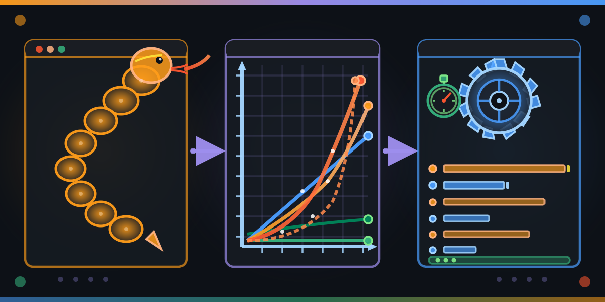

<div align="center">
  

  # big-o-python-to-rust

  **Companion repo for the Coursera course *Big O Notation: Python to Rust*.**
  Empirical, structural, and formal complexity proofs — every claim gated by a named YAML contract.

  [](LICENSE-MIT)
</div>

---

## What this repo demonstrates

Big O is taught in three layered modes of proof. Every complexity claim in this repo is gated by a YAML contract:

| Mode | Verification | Where it lives |
|---|---|---|
| **Empirical** | `criterion` ratio bounds over doubling input sizes | `contracts/complexity-*-v1.yaml` + `m2-empirical/` |
| **Structural** | Recurrence relations + amortized analysis | `m3-structural/` |
| **Formal** | Lean 4 theorems (master theorem, Fibonacci closed form, sorting lower bound) | `lean/BigOFromZero/` |

The contracts are the source of truth. `pv validate` gates the schema, `pv score` rates the rubric, `pmat comply check` enforces that every Rust crate has at least one binding contract. Coverage gate is 100% on `cargo llvm-cov`.

## Examples

All examples use a UFC fighter roster — Elo lookup (O(1)), weight-class boundary (O(log n)), unbeaten count (O(n)), rank-then-total (O(n log n)), rivalry pairs (O(n²)), tournament brackets (O(2ⁿ)). The 14 course lessons on idiomatic Python → Rust translations (`dict` → `HashMap`, list-comp → iterator, `sorted` → `sort_unstable`, `Optional` → `Option`, `try/except` → `Result`, mutable-default → ownership, `generator` → iterator, `subprocess` → `Command`, `threading` → `rayon`, plus the 5-step `depyler` playbook and *when not to translate*) are woven through M1–M5 as the concrete pattern-anchors for each complexity class.

## Quick start

```bash
make install          # pv + pmat on PATH
make comply-init      # one-time: writes .pmat/project.toml
make ci               # fmt + clippy + test + coverage (100%) + pv lint + pmat comply
```

## The eight contracts

| Contract | What it asserts |
|---|---|
| `complexity-constant-v1` | mean(t @ 2n) / mean(t @ n) ∈ [0.85, 1.15] |
| `complexity-logarithmic-v1` | mean(t @ 2n) − mean(t @ n) ≤ C (additive) |
| `complexity-linear-v1` | mean(t @ 2n) / mean(t @ n) ∈ [1.8, 2.2] |
| `complexity-linearithmic-v1` | Least-squares fit of `a·n·log₂(n) + b` achieves R² ≥ 0.95 |
| `complexity-quadratic-v1` | mean(t @ 2n) / mean(t @ n) ∈ [3.6, 4.4] |
| `complexity-exponential-v1` | mean(t @ n+1) / mean(t @ n) ∈ [1.8, 2.2] |
| `iterator-fusion-v1` | No intermediate `Vec` alloc in chained iterators; wall-clock within 10% of hand loop |
| `complexity-preserved-across-transpile-v1` | `depyler(S)` sits in the same Big O class as `S`; constant-factor speedup is reported |

## Module map

| Module | Crate | Theme |
|---|---|---|
| M1 | `m1-modes` | The three modes of proof — when each works |
| M2 | `m2-empirical` | criterion-gated complexity contracts (all six classes) |
| M3 | `m3-structural` | Recurrence + amortization; Lean master theorem |
| M4 | `m4-systems` | Cache complexity, I/O complexity, work-depth parallelism |
| M5 | `m5-capstone` | Characterize a novel algorithm in all three modes |

## Python companion notebooks

One testable notebook per module. Every code cell ends in `assert` statements; `make notebooks-test` executes each top-to-bottom and fails the build if any assertion fires. Operation-count proofs (deterministic, Colab-friendly) replace criterion wall-clock for the asserts; lint + format via `ruff` (configured in `pyproject.toml`); env via `uv`.

| Module | Notebook | Open in Colab |
|---|---|---|
| M1 — Three Modes | [`notebooks/m1-modes.ipynb`](notebooks/m1-modes.ipynb) | [](https://colab.research.google.com/github/paiml/big-o-python-to-rust/blob/main/notebooks/m1-modes.ipynb) |
| M2 — Empirical Complexity Contracts | [`notebooks/m2-empirical.ipynb`](notebooks/m2-empirical.ipynb) | [](https://colab.research.google.com/github/paiml/big-o-python-to-rust/blob/main/notebooks/m2-empirical.ipynb) |
| M3 — Structural Proofs | [`notebooks/m3-structural.ipynb`](notebooks/m3-structural.ipynb) | [](https://colab.research.google.com/github/paiml/big-o-python-to-rust/blob/main/notebooks/m3-structural.ipynb) |
| M4 — Cache + Parallel + I/O | [`notebooks/m4-systems.ipynb`](notebooks/m4-systems.ipynb) | [](https://colab.research.google.com/github/paiml/big-o-python-to-rust/blob/main/notebooks/m4-systems.ipynb) |
| M5 — Capstone: Top-K | [`notebooks/m5-capstone.ipynb`](notebooks/m5-capstone.ipynb) | [](https://colab.research.google.com/github/paiml/big-o-python-to-rust/blob/main/notebooks/m5-capstone.ipynb) |

The notebook source of truth is [`scripts/build_notebooks.py`](scripts/build_notebooks.py). Regenerate via `make notebooks-build`; verify everything via `make notebooks-ci` (build + format-check + lint + execute).

## Methodology

Per the [PAIML Provable Contracts methodology](https://github.com/paiml/pmat): **never write code without a contract**. Every public function in this workspace is bound to at least one contract via `contracts/binding.yaml`, and `pmat comply check` blocks the build if a binding is missing.

The course this repo accompanies is the final algorithmic-foundations course in a 31-course Rust specialization, taken after [c7 Design by Provable Contracts](https://github.com/paiml/provable-contracts). Familiarity with `pv` and YAML contract authoring is assumed.

## Documented deferrals

| ID | Contract | Why deferred | Where it lands |
|---|---|---|---|
| `FALSIFY-IF-001` | `iterator-fusion-v1` | Asm inspection ("no `__rust_alloc` symbol") cannot be expressed as a Rust unit test — it needs a `cargo-show-asm` post-build pass. The Rust unit + proptest suite covers `FALSIFY-IF-003` (result equivalence); `benches/criterion_demo.rs` covers `FALSIFY-IF-002` (wall-clock parity); the asm gate runs as a separate external check. |

## License

Dual-licensed under [MIT](LICENSE-MIT) and [Apache 2.0](LICENSE-APACHE).
